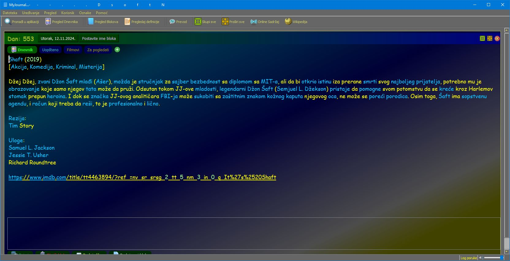

# MyJournal

MyJournal is a Python-based personal journaling application designed to help users document their daily thoughts and experiences in an easy-to-use interface.

## Features
- Simple, intuitive user interface.
- Ability to create, edit, and delete journal entries.
- Add definition for each word in your entry.
- Search and filter entries.
- Multiple languages support.
- OnLine news and service information.
- Export and import journal entries and definitions.
- Exchange entries and definitions with other users through Export-Import feature.
- Highly customizable settings.
- Support for multiple user accounts.


## Screenshot


## Installation
MyJournal is developed using Python 3.11.3, and uses module `googletrans 3.1.0a0` that doesn't support Python 3.13 or newer !

1. Clone this repository:
   ```bash
   git clone https://github.com/yourusername/MyJournal.git
   ```
2. Navigate to the project directory:
   ```bash
   cd MyJournal
   ```
3. Install the required dependencies:
   ```bash
   pip install -r requirements.txt
   ```
4. Run the application:
   ```bash
   python main.py
   ```

## Usage
- Launch the application and start adding your journal entries and definitions.

## License
This project is licensed under the MIT License. See the [LICENSE](LICENSE) file for details.

## Contributing
Contributions are welcome! Please submit a pull request or open an issue for suggestions and improvements.

## Acknowledgments
- Developed with Python, PyQt5 library and various open-source libraries.
- Special thanks to the contributors of related projects.

---
Feel free to explore, fork, and share your feedback!
